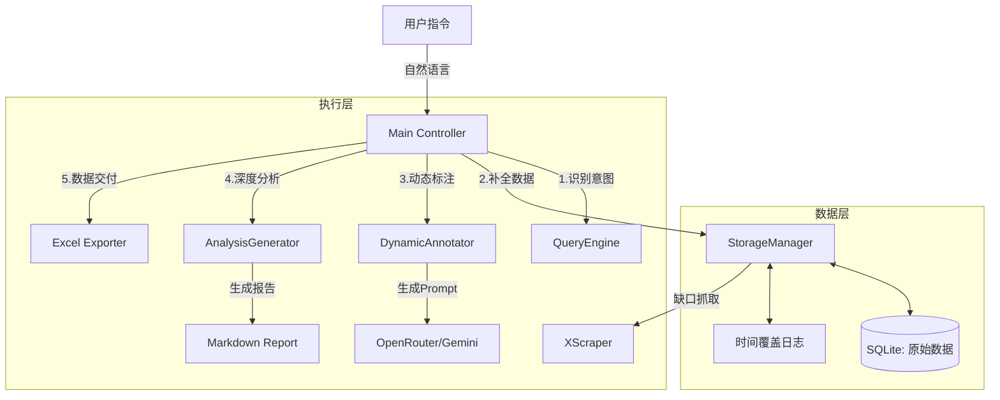

# 🧠 XSkill - AI Investment Intelligence Agent

> **专为 VC 投资研究设计的自动化情报中控台。**
> 
> 让 AI 帮你 24/7 监控百位科技 KOL，自动补全数据缝隙，即时标注投资信号，并生成投研级分析报告。


## 🚀 核心价值 (Why XSkill?)

传统的投研情报收集面临三大痛点：
1. **数据碎片化**：需要在 Twitter, Substack 等多个平台手动翻阅。
2. **分析滞后**：人工阅读数百条推文既耗时又容易遗漏早期的微弱信号。
3. **流程割裂**：抓取、清洗、翻译、分析、导出通常分散在不同工具中。

**XSkill** 作为一个智能 Agent，通过以下核心能力解决这些问题：

- **🕵️‍♀️ 智能账号发现**：自动监控 Zara 等源头的推荐名单，动态扩充情报池。
- **🧩 时间缝隙补全**：独创的算法自动计算本地数据缺口，只抓取缺失的时间段，避免重复工作。
- **🏷️ 无状态动态标注**：不污染原始数据库，根据每次查询意图（如"分析情感"或"寻找SaaS机会"）动态生成标注 Schema。
- **🧠 深度趋势分析**：基于 LLM (Gemini/Claude) 生成 VC 视角的深度研报，识别 "Under-hyped" 早期机会。

---

## 🏗️ 系统架构

XSkill 采用模块化 Agent 设计：



## 🛠️ 快速开始

### 1. 安装

```bash
# 克隆项目
git clone https://github.com/your-username/xskill.git
cd xskill

# 安装依赖
pip install -r requirements.txt
```

### 2. 配置环境

复制 `.env.example` 到 `.env` 并填入密钥：

```bash
cp .env.example .env
```

核心配置：
- `OPENROUTER_API_KEY`: 用于调用 LLM 进行标注和分析。
- `TWITTER_AUTH_TOKEN`: 用于 `twikit` 抓取数据。

### 3. 使用场景

**场景 A: 日常情报监控**
```bash
# 查询某人最近一周动态，并生成分析报告
python main.py "看看 @amasad 最近一周在讨论什么"
```

**场景 B: 特定赛道扫描**
```bash
# 扫描列表中的博主，寻找 AI Agent 赛道的信号
python main.py "分析 A 开头博主关于 AI Agent 的讨论" --start 2024-01-01
```

**场景 C: 数据导出**
```bash
# 仅导出数据，不做 LLM 分析
python main.py "导出 elonmusk 本月数据" --no-analyze
```

## 📂 项目结构

```
xskill/
├── core/                    # 核心引擎
│   ├── storage_manager.py   # 数据存储与时间缝隙算法 (核心)
│   ├── annotator.py         # 无状态标注引擎 (Dynamic Schema)
│   ├── exporter.py          # 投研级 Excel 导出
│   └── scrapers/            # 数据采集适配器
├── skills/                  # 高级能力
│   └── analysis_generator.py # 深度研报生成工厂
├── scripts/                 # 工具脚本
├── reports/                 # (GitIgnored) 生成的 Markdown 报告
├── exports/                 # (GitIgnored) 生成的 Excel 数据
├── main.py                  # CLI 入口
└── requirements.txt         # 依赖清单
```

## ✨ 核心技术亮点

### 1. 无状态动态标注 (Stateless Annotation)
XSkill **不**在数据库中存储 `sentiment` 或 `topic` 等主观字段。
数据库只存储 **"Facts"** (原始推文)。
当用户问 "分析情感" 时，系统实时生成 Schema -> 标注 -> 导出。
当用户问 "寻找融资信号" 时，系统生成另一套 Schema。
数据永远纯净，分析永远灵活。

### 2. 时间缝隙算法 (Time Gap Filling)
系统维护 `manifest.json` 记录所有博主的数据覆盖范围。
当请求 `2024-01-01` 至 `2024-01-30` 数据时：
若本地已有 `1.5-1.20`，系统自动计算缺失区间 `[(1.1-1.4), (1.21-1.30)]` 并只抓取这两段。

## 📜 许可证

MIT License. 专为开放投研生态构建。
